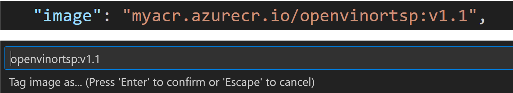

# OpenVino scripts for Object Detection IoT Edge modules and Data pipelines to Azure

OpenVino code set to run Object Detection models on IoT Edge devices.  The model scores and frames will be streamed to Azure for Fabric to ingest the data in real-time.
## 0. Pre-Requisites
* Edge device running Windows IOT and WSL Version 2 installed
* A Development machine with Vidual Studio Code
* An Azure subscription

## 1. Create IoT Hub in Azure

Follow these setup instructions to create a New Azure IoT Hub in your subscription

https://learn.microsoft.com/en-us/azure/iot-edge/quickstart?view=iotedge-1.4#create-an-iot-hub

## 2. Register IoT Hub on Edge Device

Create an IoT Edge Device in IoT Hub and Save connection string

https://learn.microsoft.com/en-us/azure/iot-edge/quickstart?view=iotedge-1.4#register-an-iot-edge-device 

## 3. Setup EFLOW on Windows 10 IoT Edge OS

 The setup instructions for EFLOW (IoT Edge for Linux on Windows)

 https://learn.microsoft.com/en-us/azure/iot-edge/quickstart?view=iotedge-1.4#install-and-start-the-iot-edge-runtime

## 4. Setup RTSP feed on Edge device host EFLOW

Follow these instructions to setup your RTSP Server and RTSP stream.  

https://github.com/nikkiconley/video-processing/blob/main/convertWebcam2RTSP.md 

* Replace step 1 with these instructions.  
    1. Open Command Prompt for Windows
    2. Type in ```ipconfig```
    3. Go to Header called, "Ethernet Adapter VEthernet".
    4. Copy IPv4 address and use for RTSP Stream & Dockerfile


## 5. Create a Container Registry

1. For this setup we plan to leverage Azure Container Registry.
    [Portal Instructions](https://learn.microsoft.com/en-us/azure/container-registry/container-registry-get-started-portal?tabs=azure-cli)


## 6. Create an IoT Edge project template in VS Code for Deployments

 If this is the first time using IoT Edge & Hub in VS Code follow these steps to setup extensions in VS Code.

 https://learn.microsoft.com/en-us/azure/iot-edge/tutorial-develop-for-linux?view=iotedge-1.4&tabs=python&pivots=iotedge-dev-ext#set-up-tools

### 6a. Follow these instructions to setup your VS Code IoT Edge Project template.

https://learn.microsoft.com/en-us/azure/iot-edge/tutorial-develop-for-linux?view=iotedge-1.4&tabs=python&pivots=iotedge-dev-ext#create-a-project-template 

1. Solution Name: vinoobject
2. Module Template: Python module
3. Module Name: openvino
4. Docker Image Repository: <your-image-login-server>/openvino

### 6b. Create another module within the current solution

1. In the command palette, Select Add IOT Edge Module
2. Select Deployment Template File : deployment.template.json
3. Module Template: Python module
4. Module Name: blobstorage
5. Docker Image Repository: <your-image-login-server>/blobstorage

## 7. Clone the Repository and copy file into IoT Edge Solution project

Change directory to your local git repo on the device

```bash
git clone https://github.com/DataSciNAll/vinoobject.git
```

Copy these files from the cloned repo to your IoT Edge project template into the same base location of your project.
* .env file
* camera.py
* deployment_template.json
* deployment_debug_template.json
* Dockerfile
* requirements.txt
* object_detection_script.py
* videoplayer.py
* Model directory and all files in directory


## 8. Setup IoT Edge Blob Storage directory on EFLOW machine.
1. Create a storage account in the same region as your IOT Hub.  Then create a blob container named images

[Instructions](https://learn.microsoft.com/en-us/azure/storage/common/storage-account-create?tabs=azure-portal)

2. On your edge device, Connect into Eflow VM via PowerSheel (as Administrator)
```
Connect-EflowVM
```

3. Create directory on server to store image files when created by object_detection_script
```
mkdir srv/containerdata
```

4. Grant corret permissions to these direcotries so OpenVino module can write to it.
```	
sudo chown -R 11000:11000 /srv/containerdata
```
```
sudo chmod -R 700 /srv/containerdata
```

## 9. Setup configuration files to run in your environment in the VS Code Solution
1. In the Dockerfile, Change parameter field "<IPADDRESS_VETHERNET>" to your Ethernet adapter VEthernet IP address.  This should be the same addresss as the RTSP stream.  See Instruction under Step 4 for guidance.

2. In object_detection_script.py, change "<CONNECTION_STRING>" to the connection string for the device you created.  You can get this from the Azure Portal under the IoT Edge Device you created.  It should look like this:

``` 
    "HostName=<your-hub-name>.azure-devices.net;DeviceId=<your-device-name>;SharedAccessKey=<your-device-key>"
``` 

3. In object_detection_script.py, change "<AZURE_STORAGE_CONNECTION_STRING>" to the connection string for the device you created.  You can get this from the Azure Portal under the Azure Blob Storage you created.  It should look like this:

``` 
    DefaultEndpointsProtocol=https;AccountName=<Account_Name>;AccountKey=<Account_key>;EndpointSuffix=core.windows.net
``` 

4. In object_detection_script.py, change "<BLOB_CONTAINER_NAME>" to name of the folder you want it to create in your Azure Blob Storage account.  It can create and reuse existing folders.  It is recommended to cleanup the files in this container each time you run the script to properly inventory the files with IoT Hub messages.

5. Update three fields in the deployment_template.json file
    * "LOCAL_STORAGE_ACCOUNT_NAME=<ENV_VARIABLE>" -- ENV_VARIABLE can be any name you like.  Recommend lowercase
    * "LOCAL_STORAGE_ACCOUNT_KEY=<ENV_KEY>"  -- Base 64 generated key https://generate.plus/en/base64 
    * "<Blob_Storage_Connection_String>" -- Update with Primary key from Blob Storage account

6. Update the container registry settings.  You can find these on the Access Keys section of your Azure Container registry

              "<ACR_REGISTRY_NAME>": {
                "username": "$CONTAINER_REGISTRY_USERNAME_<ACR_REGISTRY_NAME>",
                "password": "$CONTAINER_REGISTRY_PASSWORD_<ACR_REGISTRY_NAME>",
                "address": "<ACR_Address>"
              }

    * Replace <ACR_REGISTRY_NAME> with the registry name
    * Replace the whole string after username with the Username
    * Replace the whole string after password with the password
    * Replace <ACR_Address> with the Login Server 

7. Change <ACR_CONTAINER_ADDRESS_VERSION> to your container registry Login Server plus the name and version.  For example: 
```
    myacr.azurecr.io/openvinortsp:v1.1
```
<b>Averytime you deploy, you must increment the version</b>

## 10. Build & Test Docker Image

* Install Docker Desktop on your local machine

    https://learn.microsoft.com/en-us/azure/iot-edge/tutorial-develop-for-linux?view=iotedge-1.4&tabs=python&pivots=iotedge-dev-ext#install-container-engine

* Install and setup Docker Extension on VS Code

* Right-mouse click on Dockerfile and select 'Build Image in Azure'.

* Make sure the name and version match what you have entered in the deployment file and increment the version number for every subsequent Build



## 11. Publish Docker container to Registry

1. Copy the Container address and update "deployment.template.json" file.  Look for "<ACR_CONTAINER_ADDRESS_VERSION>" and replace it with the ACR <Login server/repository:tag>.  For example, edgesample.azurecr.io/newcontabc:v1.1

    https://learn.microsoft.com/en-us/azure/iot-edge/tutorial-develop-for-linux?view=iotedge-1.4&tabs=python&pivots=iotedge-dev-ext#build-and-push-your-solution 
    <b>Select LINUX" the the container platform</b>

## 12. Generate IoT Deployment Manifest

https://learn.microsoft.com/en-us/azure/iot-edge/tutorial-develop-for-linux?view=iotedge-1.4&tabs=python&pivots=iotedge-dev-ext#deploy-modules-to-device)

## 13. View Modules and Status on Device

Run this command to see if the proper modules are on yoru device and their status.  Go to PowerShell and run commands as administrator

```
Connect-EflowVM

iotedge list
```

This command will help you troubleshoot any error message as needed.  

```
iotedge logs <module_name>
```

Here is documentation that lists all the EFLOW commands in PowerShell.

https://learn.microsoft.com/en-us/azure/iot-edge/reference-iot-edge-for-linux-on-windows-functions?view=iotedge-1.4 

<b>** NOTE **</b>  The blobstorage module will be in error until you do step 14.  The openvino module will be in error if you do not have the RTSP feed running.


## 14. Storage Explorer connection

Here is the setup instructions to connect Azure Storage Explorer to EFLOW directories.  
    https://learn.microsoft.com/en-us/azure/iot-edge/how-to-store-data-blob?view=iotedge-1.4#connect-to-your-local-storage-with-azure-storage-explorer

1. Follow step 2 since this is a necessary step to get this to function
2. Connect to Azure Storage thru a Storage Account and the connection string.  
3. The IP address for the server requires you to get the IP for the LINUX VM ```Get-EFLOWVMAddr```
4. Use this IP address and replace it in this generic connection string 
    DefaultEndpointsProtocol=http;BlobEndpoint=http://<LINUX VM IP Address>:11002/<LOCAL_STORAGE_ACCOUNT_NAME>;AccountName=<LOCAL_STORAGE_ACCOUNT_NAME>;AccountKey=<LOCAL_STORAGE_ACCOUNT_KEY>>;
5. Create a container named, 'frame' and this will start the upload process
6. You can test the sync process by adding a file to the frame container and then check your cloud storage for the file in the images container.
